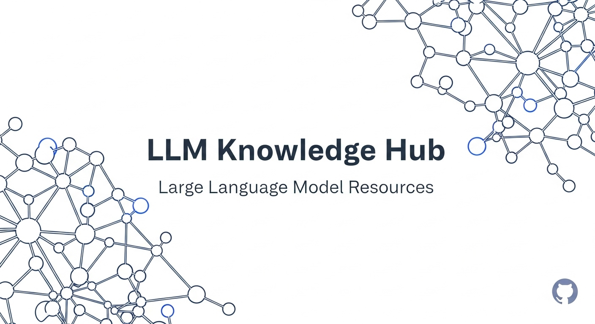

# LLM_Tale
去吧，我把关于LLm的一切都放在那里！—————哥尔·D·拉

## 📚 项目介绍

这是一个关于大语言模型（LLM）的综合知识库项目，收集了自己在开发智能体过程中使用到的LLM相关的各种资源、教程和实践经验。该项目专门解析Langchain框架以及其他智能体代码架构，帮助自己理解这些技术的内部工作机制和实现原理。

## 📖 内容涵盖

- Langchain框架源码解析
- 智能体架构设计与实现
- 提示工程技巧
- 模型微调和部署
- 应用案例分析

## 🗂️ 项目结构

### Lang-Series
该部分包含Lang系列的功能和底层结构，暂时解析Langchain框架的内部实现机制和设计模式。

## 🤝 贡献方式
欢迎提交PR或issue来补充更多LLM相关内容，如有错误不爽可直接开骂！